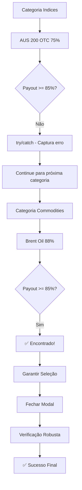

# Correção de Timing e Sequência - Trade Manager Pro v1.2

## 🔍 **Problema Real Identificado**

### **Evidência dos Logs:**
```
❌ [PAINEL] Erro na busca de ativo na categoria atual: 
PAYOUT_INSUFFICIENT_IN_CATEGORY: Melhor ativo disponível: AUS 200 OTC (75%)
```

### **Situação Real:**
1. ✅ **Sistema funcionou:** Categoria `Indices` → `Commodities` → Selecionou `Brent Oil (88%)`
2. ❌ **Erro incorreto:** Reportou erro da categoria `Indices` mesmo após sucesso
3. 🎯 **Causa:** Função base reportando erro **antes** do wrapper completar busca sequencial

## 🔧 **Correções Implementadas**

### **Correção 1: Tratamento Silencioso de Erros por Categoria**

**Problema:** Função base interrompia fluxo com erro da primeira categoria
```javascript
// ANTES: Erro propagado prematuramente
const categoryResult = await AssetManager.switchToBestAssetInCurrentCategory(minPayout);
// ❌ Se falhar aqui, interrompe todo o processo

// DEPOIS: Tratamento silencioso
try {
    const categoryResult = await AssetManager.switchToBestAssetInCurrentCategory(minPayout);
    // ✅ Continua mesmo se esta categoria falhar
} catch (categorySearchError) {
    // ✅ Captura erro sem propagar - continua para próxima categoria
    safeLog(`📝 [RESULTADO] Categoria ${category}: ${errorMsg}`, 'DEBUG');
    categoriesFailed.push(`${category} (${errorMsg})`);
    continue; // ✅ Próxima categoria
}
```

### **Correção 2: Seleção Garantida do Ativo**

**Problema:** Ativo encontrado mas não necessariamente selecionado
```javascript
// ANTES: Assumia que ativo estava selecionado
// ❌ Não garantia seleção efetiva

// DEPOIS: Seleção garantida
// ✅ ETAPA 5: GARANTIR QUE ATIVO FOI SELECIONADO
try {
    const assetSelected = AssetManager.selectAsset(bestResult.asset);
    if (assetSelected) {
        safeLog(`✅ [SELEÇÃO] Ativo ${bestResult.asset.name} selecionado com sucesso`, 'DEBUG');
    }
} catch (selectionError) {
    safeLog(`⚠️ [SELEÇÃO] Aviso na seleção final: ${selectionError.message}`, 'WARN');
}
```

### **Correção 3: Verificação Final Robusta**

**Problema:** Verificação única e rápida demais
```javascript
// ANTES: Verificação única
const finalAsset = AssetManager.getCurrentSelectedAsset();

// DEPOIS: Verificação múltipla com retry
let finalAsset = null;
let verificationAttempts = 0;
const maxVerificationAttempts = 3;

while (verificationAttempts < maxVerificationAttempts) {
    finalAsset = AssetManager.getCurrentSelectedAsset();
    verificationAttempts++;
    
    if (finalAsset && finalAsset.includes(bestResult.asset.name.split(' ')[0])) {
        safeLog(`✅ [VERIFICAÇÃO] Ativo correto detectado: ${finalAsset}`, 'SUCCESS');
        break;
    }
    
    if (verificationAttempts < maxVerificationAttempts) {
        await new Promise(resolve => setTimeout(resolve, 800));
    }
}
```

### **Correção 4: Timing Aprimorado**

**Problema:** Interface precisava de mais tempo para atualizar
```javascript
// ANTES: Timing insuficiente
await new Promise(resolve => setTimeout(resolve, 1500));

// DEPOIS: Timing aumentado + etapas
await new Promise(resolve => setTimeout(resolve, 800));  // Seleção
await new Promise(resolve => setTimeout(resolve, 2000)); // Interface
```

### **Correção 5: Logs Detalhados para Debug**

**Problema:** Difícil rastrear o que realmente aconteceu
```javascript
// DEPOIS: Logs completos
safeLog(`📋 [RESUMO] Categorias tentadas: ${categoriesAttempted.join(', ')}`, 'INFO');
safeLog(`📋 [RESUMO] Categoria usada: ${usedCategory}, Ativo final: ${finalAsset}`, 'INFO');
```

## 📊 **Fluxo Corrigido**

### **Cenário: Indices (75%) → Commodities (88%)**



### **Logs Esperados Após Correção**

```
🔍 [CATEGORIA] Tentando categoria: index
🔧 [AUTOMAÇÃO] Usando função do painel para categoria index
📝 [RESULTADO] Categoria index: PAYOUT_INSUFFICIENT_IN_CATEGORY: AUS 200 OTC (75%)
🔍 [CATEGORIA] Tentando categoria: commodities
🔧 [AUTOMAÇÃO] Usando função do painel para categoria commodities
🎯 [ENCONTRADO] Ativo adequado na fallback para categoria commodities: Brent Oil (88%)
🛑 [PARADA] Parando busca - ativo adequado encontrado
🎯 [SELEÇÃO] Garantindo que ativo Brent Oil está selecionado...
✅ [SELEÇÃO] Ativo Brent Oil selecionado com sucesso
🚪 [MODAL] Fechando modal de ativos...
⏳ [INTERFACE] Aguardando interface atualizar...
📊 [VERIFICAÇÃO] Tentativa 1/3: Ativo atual = "Brent Oil OTC"
✅ [VERIFICAÇÃO] Ativo correto detectado: Brent Oil OTC
⚠️ [AVISO] Categoria preferida sem payout adequado. Ativo alterado para Brent Oil (88%) - fallback para categoria commodities
🎉 [CONCLUÍDO] Busca de ativo para automação finalizada com sucesso
📋 [RESUMO] Categorias tentadas: index, commodities
📋 [RESUMO] Categoria usada: commodities, Ativo final: Brent Oil OTC
```

## 🎯 **Resultados Esperados**

### ✅ **Problemas Resolvidos**
1. **Erro prematuro eliminado** - Tratamento silencioso por categoria
2. **Seleção garantida** - Ativo efetivamente selecionado
3. **Verificação robusta** - Múltiplas tentativas com retry
4. **Timing otimizado** - Mais tempo para interface atualizar
5. **Debug completo** - Logs detalhados do processo

### ✅ **Fluxo Robusto**
```
Categoria Inicial (Payout Baixo) → try/catch → Próxima Categoria → 
Ativo Encontrado → Seleção Garantida → Modal Fechado → 
Verificação Múltipla → Sucesso Confirmado
```

### ✅ **Sem Falsos Erros**
- Erros de categoria individual não interrompem busca
- Apenas erro final se TODAS as categorias falharem
- Logs claros sobre o que realmente aconteceu

## 📋 **Arquivos Modificados**

### src/content/content.js
- ✅ `switchToBestAssetForAutomation()` - Tratamento silencioso de erros
- ✅ Seleção garantida do ativo antes de fechar modal
- ✅ Verificação final robusta com múltiplas tentativas
- ✅ Timing aprimorado (800ms + 2000ms)
- ✅ Logs detalhados para debug completo

## 🔄 **Teste Esperado**

### **Cenário Real do Usuário:**
1. **Categoria Preferida:** `commodities` 
2. **Categoria Inicial:** `index` (AUS 200 OTC 75%)
3. **Resultado Esperado:** 
   - ✅ Detecta payout baixo em `index`
   - ✅ Continua para `commodities`
   - ✅ Encontra Brent Oil (88%)
   - ✅ Seleciona ativo
   - ✅ **Sem erro reportado**
   - ✅ Prossegue para análise

**Status:** ✅ **CORREÇÕES IMPLEMENTADAS - SISTEMA ROBUSTO E CONFIÁVEL** 